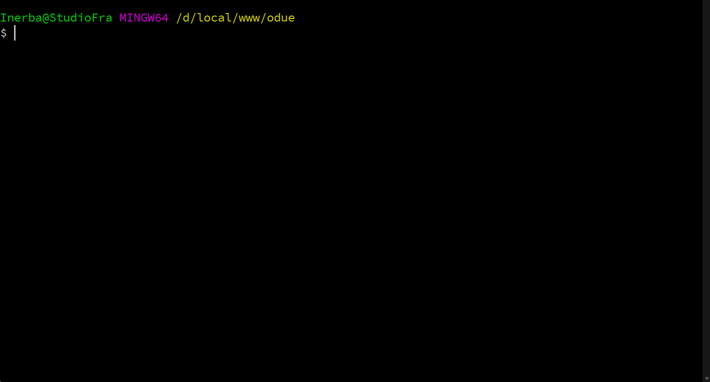

<div class="filament-hidden">


</div>

This project is a fork of https://github.com/inerba/filament-db-config.  
I only retrieved the source code to customize and use it privately, including renaming namespaces and adding several scenarios for encrypting data before storage.

Special thanks to the original author for their great work.

`
composer require ngankt2/filament-db-config-encrypt`

# DB Config – Lightweight settings & content manager for Filament

<div class="filament-hidden">

[](https://packagist.org/packages/inerba/filament-db-config)
[](https://github.com/inerba/filament-db-config/actions/workflows/tests.yaml)
[](https://packagist.org/packages/inerba/filament-db-config)
[](https://packagist.org/packages/inerba/filament-db-config)
[](https://packagist.org/packages/inerba/filament-db-config)

</div>

⭐ Star this repo if it helps you - it truly motivates us to do more. 🙏😊

<div class="filament-hidden">

[](https://x.com/intent/tweet?text=Check%20out%20this%20project%20on%20GitHub:%20https://github.com/inerba/filament-db-config%20%23OpenIDConnect%20%23Security%20%23Authentication)
[](https://www.facebook.com/sharer/sharer.php?u=https://github.com/inerba/filament-db-config)
[](https://www.linkedin.com/sharing/share-offsite/?url=https://github.com/inerba/filament-db-config)
[](https://www.reddit.com/submit?title=Check%20out%20this%20project%20on%20GitHub:%20https://github.com/inerba/filament-db-config)
[](https://t.me/share/url?url=https://github.com/inerba/filament-db-config&text=Check%20out%20this%20project%20on%20GitHub)

</div>

DB Config is a Filament plugin that provides a simple, database-backed key/value store for **application settings** and **editable content**.  
It’s ideal both for storing configuration (like site name, contact info, labels) and for managing page sections (homepage hero, landing blocks, about text, etc.) without the need for a full CMS.

- 🔑 Store application settings in a simple key/value table  
- 📝 Manage editable content (homepages, landing pages, about sections)  
- ⚡ Use any Filament form fields or layouts — including third-party ones  
- 🗄️ Transparent caching, no extra boilerplate, zero external deps  

It provides a clean set of simple helpers for reading and writing values, with transparent caching under the hood, and persists data as JSON in a dedicated table.  
It is framework-friendly and requires no custom Eloquent models in your app.



<div class="filament-hidden">
<b>Table of Contents</b>

- [DB Config – Lightweight settings \& content manager for Filament](#db-config--lightweight-settings--content-manager-for-filament)
  - [Requirements](#requirements)
  - [Installation](#installation)
  - [🚀 Getting Started](#-getting-started)
  - [Configuration](#configuration)
  - [Advanced Usage](#advanced-usage)
    - [Generate a settings page](#generate-a-settings-page)
    - [Read \& write values](#read--write-values)
      - [Read a value (helper)](#read-a-value-helper)
      - [Blade directive](#blade-directive)
      - [Read a value (class)](#read-a-value-class)
      - [Write a value](#write-a-value)
      - [Read an entire group as associative array](#read-an-entire-group-as-associative-array)
      - [Facade (optional)](#facade-optional)
    - [Set Default Values](#set-default-values)
    - [Working with nested values](#working-with-nested-values)
  - [How it works](#how-it-works)
    - [Database](#database)
    - [Caching behavior](#caching-behavior)
    - [Return values and defaults](#return-values-and-defaults)
  - [Why use DB Config when Spatie Settings already exists?](#why-use-db-config-when-spatie-settings-already-exists)
  - [Security considerations](#security-considerations)
  - [Testing](#testing)
  - [Versioning](#versioning)
  - [License](#license)
  
</div>

## Requirements

- PHP version supported by your Laravel installation
- Laravel 12
- A database engine with JSON support (MySQL 5.7+, MariaDB 10.2.7+, PostgreSQL, SQLite recent versions)
- Filament 4

## Installation

1. **Install the package** via Composer:

    ```bash
    composer require inerba/filament-db-config
    ```

2. **Publish the assets** (Configuration and Migration):

    ```bash
    php artisan vendor:publish --tag="db-config-migrations"
    ```

3. **Run the migration**:

    ```bash
    php artisan migrate
    ```

    This command executes the migration file that you just published, creating the `db_config` table (or the custom table name you defined in the config file) in your database. Your package is now ready to use!

> [!TIP]
> If you want to use a custom table name instead of `db_config`, edit the configuration file `config/db-config.php` before running the migration. See the [Configuration](#configuration) section for details.

## 🚀 Getting Started

Get up and running in just a few steps:

1. **Generate Your First Settings Page**
   
    ```bash
    php artisan make:db-config Website
    ```

    This command creates a new Filament page (e.g., App/Filament/Pages/WebsiteSettings.php). You can repeat this step for more pages as needed.

> [!NOTE]
> The generator will automatically add the “Settings” suffix to the page name for consistency (e.g., WebsiteSettings), but you can use any group name you wish.


2. **Define Your Fields**

    Open the generated page and customize the form() method with your desired fields:

    ```php
    public function form(Form $form): Form
    {
        return $form
            ->components([
                TextInput::make('site_name')->label('Site Name'),
                TextInput::make('contact_email')->label('Contact Email'),
                Toggle::make('maintenance_mode')->label('Maintenance Mode'),
            ])
            ->statePath('data');
    }
    ```

> [!NOTE]
> You may use **any Filament form fields or layout components - including third-party ones -** to build your settings and content pages, giving you full flexibility in how data is structured and edited.

3. **Save and Edit Settings from the Admin Panel**

    You can now edit these settings directly in your Filament admin panel—no extra boilerplate needed.

4. **Use Your Settings Anywhere**

    Retrieve your configuration values easily:
   - In PHP:

       ```php
       $siteName = db_config('website.site_name', 'Default Site Name');
       ```

   - In Blade:

       ```html
       <h1>{{ db_config('website.site_name', 'Default Site Name') }}</h1>

       <!-- or -->

       <h1>@db_config('website.site_name', 'Default Site Name')</h1>
       ```

**That’s it!** 🎉

Define your fields, save from the admin panel, and access your settings anywhere in your Laravel app.

## Configuration

You can customize the behavior of the package by publishing the configuration file:

```bash
php artisan vendor:publish --tag="db-config-config"
```

<details><summary><b>Details</b></summary>

**Table Name**: By default, settings are stored in the db_config table. You can change this by modifying the table_name value. This is useful to avoid collisions or to follow a specific naming convention.

```PHP
'table_name' => 'db_config',
```

**Cache Behavior**: The package uses caching to minimize database queries. You can fine-tune the cache settings.

- **prefix**: All cache keys generated by the package will use this prefix. Changing this can prevent collisions with other cache keys in your application.

- **ttl**: Defines the cache lifetime in minutes. By default, it's null, which means settings are cached forever. You can specify a number of minutes to have the cache expire periodically.

```PHP
'cache' => [
    'prefix' => 'my-app-settings',
    'ttl' => 60, // Cache for 1 hour
],
```
</details>

## Advanced Usage

### Generate a settings page

DB Config ships with an Artisan generator and an abstract Page class to quickly scaffold Filament settings pages.

```bash
php artisan make:db-config
```
<details><summary><b>Details</b></summary>

Arguments can be omitted: if you don’t provide them, the command will enter interactive mode and prompt you for the group name (name) and, optionally, the panel (panel). You can also pass them on the command line to avoid interactive prompts.

Parameters:

- `name`: the settings group name (e.g. `website`). It is used to generate the view name and the class name (singular, capitalized).
- `panel` (optional): the Filament panel to create the page in (e.g. `Admin`). If omitted the default panel is used.

Examples:

```bash
php artisan make:db-config website            # default panel
php artisan make:db-config website admin      # specific panel (e.g. Admin)
```

What is generated:

- A Page class at `app/Filament/{Panel}/Pages/{Name}Settings.php` (the class name is the singular form of `{name}` + `Settings`, e.g. `WebsiteSettings.php`).
- A Blade view at `resources/views/filament/config-pages/{slug-name}-settings.blade.php` (the view name is a slugified version of the `name` with a `-settings` suffix).

Behavior:

- The command does not overwrite existing files: if the class or the view already exist it will warn and leave the files intact.
- Names are normalized: the class uses the singular form of the provided name, the view is slugified (spaces and special characters are converted).

Note: the generated class extends `Ngankt2\DbConfig\AbstractPageSettings` and the view is placed under `resources/views/filament/config-pages/`.

Page lifecycle and saving:

- On `mount()`, the page loads all settings for the given group (defined by `settingName()`) via `DbConfig::getGroup()` and fills the page content state.
- A built-in header action “Save” persists the current state by calling `DbConfig::set("{group}.{key}", $value)` for each top-level key present in the page content.

Defining the page content:

- Implement `protected function settingName(): string` to define the group name (e.g. `website`).
- Implement `public function content(Schema $schema): Schema` and return your content schema.
- Set `->statePath('data')` so the page state is bound to the `$data` property and saved correctly.

Example page content (Filament schema):

```php
use Filament\Forms\Components\TextInput;
use Filament\Schemas\Schema;

public function content(Schema $schema): Schema
{
    return $schema
        ->components([
            TextInput::make('site_name')->required(),
            // ... other inputs
        ])
        ->statePath('data');
}
```

</details>

### Read & write values

The simplest way to manage values is through the **Filament pages scaffolded by DB Config**:  
you can define the fields you need (text inputs, toggles, repeaters, rich text, even third-party components) and edit them directly in the admin panel.  
All changes are saved automatically in the `db_config` table and cached for fast access.

For programmatic access, the package also provides simple helpers and static methods:

#### Read a value (helper)

```php
db_config('website.site_name', 'Default Name');
```

#### Blade directive

You can also access values directly inside Blade templates:

```blade
@db_config('website.site_name', 'Default Name')
```

#### Read a value (class)

```php
\Ngankt2\DbConfig\DbConfig::get('website.site_name', 'Default Name');
```

#### Write a value

```php
\Ngankt2\DbConfig\DbConfig::set('website.site_name', 'Acme Inc.');
```

#### Read an entire group as associative array

```php
\Ngankt2\DbConfig\DbConfig::getGroup('website');
// => [ 'site_name' => 'Acme Inc.', 'contact' => ['email' => 'info@acme.test'] ]
```

#### Facade (optional)

```php
\Ngankt2\DbConfig\Facades\DbConfig::get('website.site_name');
```

> [!NOTE]
> these values are **not** part of Laravel’s config() cache.
Always use db_config() or @db_config instead of config(). The `db_config()` helper is auto-registered by the package and is the recommended way to read values in application code.

### Set Default Values

You can provide default values for your settings page. This is useful for pre-filling the form with sensible defaults when it's accessed for the first time. It guides the user by showing recommended settings, which they can then adjust or save directly to establish a working configuration without manual setup.

To define default values, simply override the getDefaultData() method in your settings page class and return an array of key-value pairs.

Example:

```php
    use Filament\Forms\Components\TextInput;
    use Filament\Forms\Components\Toggle;
    use Filament\Schemas\Schema;

    /**
     * Set the default values to pre-fill the form.
     *
     * @return array<string,mixed>
     */
    public function getDefaultData(): array
    {
        return [
            'posts_per_page' => 10,
            'allow_comments' => true,
        ];
    }

    public function form(Schema $schema): Schema
    {
        return $schema
            ->components([
                TextInput::make('posts_per_page')->required(),
                Toggle::make('allow_comments'),
            ])
            ->statePath('data');
    }
}
```

When the settings page is loaded, the getDefaultData() method provides the initial values to populate the form fields. These defaults are only used if no value for a given field has been previously saved to the database.

It's important to note that these default values are not persistent until the user explicitly clicks the "Save" button.

### Working with nested values

DB Config uses a `group.setting` format for keys, with optional nested sub-keys resolved from JSON.

- The first segment is the **group**  
- The second is the **top-level key**  
- Any remaining segments are treated as nested paths inside the JSON value  

Example:

```php
// Store a nested structure
\Ngankt2\DbConfig\DbConfig::set('profile.preferences', [
    'theme' => 'dark',
    'notifications' => ['email' => true, 'sms' => false],
]);

// Read a nested value with default
db_config('profile.preferences.theme', 'light'); // 'dark'

// Read a missing nested value
db_config('profile.preferences.timezone', 'UTC'); // 'UTC'
```

## How it works

Settings are organized by a two-part key: `group.setting`, with optional nested sub-keys (e.g. `group.setting.nested.key`).

Under the hood:

- **Database Storage:** Settings are stored in a database table (by default `db_config`), with one row per `(group, key)`. The actual settings are stored as a JSON payload in the `settings` column.
- **Intelligent Caching:** Reads are cached to ensure high performance. By default, they are cached forever, but you can configure a specific TTL (Time To Live) in the config file.
- **Configurable Cache Keys:** The cache key is generated using a configurable prefix (`db-config` by default) followed by the group and setting (e.g., `db-config.website.site_name`).
- **Automatic Cache Invalidation:** Writes automatically clear the corresponding cache entry, ensuring that data always stays fresh.

### Database

The `db_config` table contains:

- `id` (bigint, primary key)
- `group` (string)
- `key` (string)
- `settings` (json, nullable)
- `created_at`, `updated_at` (timestamps)

There is a unique index on (`group`, `key`). Timestamps are present but not used by the package logic and may remain null depending on your database defaults.

> This package stores settings as JSON. Ensure your chosen database supports JSON columns. For SQLite (common in tests), JSON is stored as text and works transparently for typical use cases.

### Caching behavior

To minimize database traffic, DB Config comes with a powerful caching layer. Here’s how it works:

- **Default Behavior:** By default, settings are cached **forever**. The first time a setting is read, it's fetched from the database and stored in the cache. All subsequent reads will hit the cache directly, making them incredibly fast.
- **Automatic Cache Invalidation:** When you use `DbConfig::set()` or the "Save" action on a settings page, the cache for the affected `(group, setting)` pair is automatically cleared. This ensures that the next read will fetch the fresh value from the database.
- **Configurable TTL:** You can change the default behavior by setting a `ttl` (Time To Live) in minutes in the `config/db-config.php` file. If a TTL is set, the package will use a temporary cache that expires after the specified duration.
- **Manual Cache Clearing:** When debugging, you can clear the entire framework cache using `php artisan cache:clear` to reset all cached settings.

### Return values and defaults

- If a value or nested path does not exist, the provided default is returned.
- If the stored JSON value is `null`, the default is returned.
- `getGroup()` returns an associative array of all settings for the group, or an empty array if none exist.

## Why use DB Config when Spatie Settings already exists?

Both [DB Config](https://github.com/inerba/filament-db-config) and the official [Spatie Laravel Settings Plugin](https://github.com/filamentphp/spatie-laravel-settings-plugin) solve a similar problem - managing application settings in Laravel + Filament - but they take very different approaches.  
Spatie Settings focuses on **strict typing, validation, and integration with your domain logic**, while DB Config is designed to be **lightweight, flexible, and quick to set up**, even for editable content blocks.

<details><summary><b>Show comparison table between DB Config and Spatie Settings</b></summary>

The table below highlights the key differences so you can choose the right tool for your project:

| Feature           | DB Config                                                                | Spatie Laravel Settings Plugin                                                      |
| ----------------- | ------------------------------------------------------------------------ | ----------------------------------------------------------------------------------- |
| **Setup**         | Ready to use, no extra classes or migrations                             | Requires a dedicated `Settings` class for each group, plus migration to register it |
| **Data storage**  | Single `db_config` table with JSON values                                | Each group stored as its own settings record (linked to its Settings class)         |
| **Boilerplate**   | None required                                                            | A new PHP class must be created for every settings group                            |
| **Access**        | Dot notation, supports nested keys in JSON                               | Strongly typed properties defined in the Settings class                             |
| **Cache**         | Built-in, refreshed automatically on write                               | Built-in, but usually configured explicitly                                         |
| **Ideal for**     | Application settings and editable page content (homepage, blocks, texts) | Strictly typed, validated settings tightly bound to app logic                       |
| **Content usage** | Can store full page sections (homepage, landing, about, etc.)            | Not designed for CMS-like use                                                       |
| **Dependencies**  | No external deps                                                         | Requires `spatie/laravel-settings`                                                  |

Choose **DB Config** if you want:

- A **lightweight key/value system** for both settings and content.
- Minimal setup, no boilerplate code.
- Flexibility to manage simple settings and even **page content** directly in Filament.

Choose **Spatie Laravel Settings Plugin** if you need **strict typing, validation, and DTOs** as part of your domain logic.
</details>

## Security considerations

> [!CAUTION]
> DB Config is a place for values you want admins to edit safely at runtime, not for infrastructure secrets (API keys, DB credentials).

Values are not encrypted by default. If you need encryption, apply it before using the package’s helpers to read or write values.

## Testing

This package comes with a full test suite powered by Pest. To run the tests, first install the development dependencies:

```bash
composer install
```

Then, run the test suite from the root of the project:

```bash
./vendor/bin/pest
```

The package also uses GitHub Actions to automatically run tests on every push and pull request, ensuring that the code remains stable and reliable.

## Versioning

This package follows semantic versioning. Use a version constraint compatible with your Laravel version as shown in the installation section.

## License

The MIT License (MIT). See the LICENSE file for more details.
